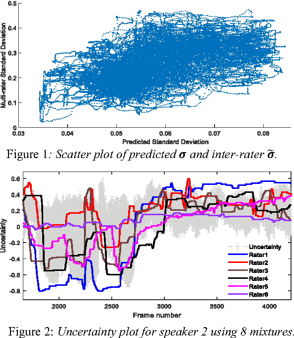

# Emotion Prediction Uncertainty Using Gaussian Mixture Regression
This code is developed to predict uncertainty information of emotion by  multi-rater information. 



## Abstract
<p style="text-align: justify;">
Existing continuous emotion prediction systems implicitly assume that prediction certainty does not  vary with time. However, perception differences among raters and other possible sources of variability suggest that prediction certainty varies with time, which warrants deeper consideration. In this paper, the correlation between the inter-rater variability and the uncertainty of predicted emotion is firstly studied. A new paradigm that estimates the uncertainty in prediction is proposed based on the strong correlation uncovered in the RECOLA database. This is implemented by including the inter-rater variability as a representation of the uncertainty information in a probabilistic Gaussian Mixture Regression (GMR) model. In addition, we investigate the correlation between the uncertainty and the performance of a typical emotion prediction system utilizing average rating as the ground truth, by comparing the prediction performance in the lower and higher uncertainty regions. As expected, it is observed that the performance in lower uncertainty regions is better than that in higher uncertainty regions, providing a path for improving emotion prediction systems. 
</p>

```
@inproceedings{dang2017investigation,
  title={An Investigation of Emotion Prediction Uncertainty Using Gaussian Mixture Regression.},
  author={Dang, Ting and Sethu, Vidhyasaharan and Epps, Julien and Ambikairajah, Eliathamby},
  booktitle={INTERSPEECH},
  pages={1248--1252},
  year={2017}
}
```